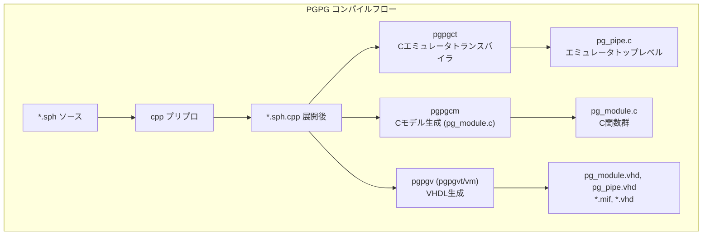

# PGPG 設計仕様書

> **注意**: 本ドキュメントは設計仕様書です。変更履歴や実装の詳細な変更点については、`ChangeLog`を参照してください。本ドキュメントでは、現在のシステムの設計と仕様を記述します。
>
> **関連**: プロジェクト概要とクイックスタートは [README.md](../README.md) を参照してください。
>
> **参考文献**: Hamada, T., Fukushige, T., & Makino, J. (2005). PGPG: An Automatic Generator of Pipeline Design for Programmable GRAPE Systems. *PASJ*, 57(5), 799–813. [arXiv:astro-ph/0703182](https://arxiv.org/abs/astro-ph/0703182)
>
> **関連ドキュメント**: 技術論文の時代背景・先行研究・影響については [paper/README.md](../paper/README.md) を参照。

---

## 1. 概要

### 1.1 PGPGとは

**PGPG**（**P**ipeline **G**enerator for **P**rogrammable **G**RAPE）は、**PROGRAPE**（Programmable GRAPE）やその他の **FBCE**（FPGA-Based Computing Engine）向けに、パイプライン処理器の低レベル設計と通信ソフトウェアを自動生成するソフトウェアである。

PROGRAPE は FPGA チップと粒子メモリから構成される再構成可能な計算装置であり、重力計算、SPH 相互作用、画像処理など様々なパイプライン処理器を同一ハードウェアに実装できる。**PROGRAPE-1**（Hamada et al. 1999/2000）で初実装された Programmable GRAPE の開発では、パイプライン設計に 1 人年以上を要した。PGPG は、**PGDL**（PGPG Description Language）で記述された高レベル設計から、VHDL ハードウェア記述、ビットレベルエミュレータ、ホスト用インターフェースソフトウェアを**一括生成**し、この設計生産性の壁を解消する。

主な用途は **N体シミュレーション**（重力計算、SPH 流体シミュレーションなど）における粒子間相互作用のパイプライン化である。**対数表現**（Logarithmic Number System）を用いることで、乗除算を加減算に変換し、ハードウェアの複雑さと遅延を削減する。

### 1.2 設計の特徴

| 項目 | 特徴 |
|------|------|
| **数値表現** | 固定小数点（fix/ufix）、対数表現（log）、浮動小数点（FLP）の併用 |
| **出力形式** | VHDL（ハードウェア）、Cソース（ビットレベルエミュレータ・インターフェース） |
| **対象FPGA** | Altera（APEX20K, APEX20KE, APEX20KC, Cyclone, Stratix） |
| **ハードウェア** | PROGRAPE-2 対応 |
| **パイプライン** | 可変段数、マルチパイプ（NPIPE）、仮想マルチパイプ（NVMP）対応 |
| **データパス** | JDATA_WIDTH で指定された幅のビット列によるジョブデータ転送 |

### 1.3 主な貢献者

- **Tsuyoshi Hamada**（東京大学・総合文化研究科）
- **Toshiyuki Fukushige**（東京大学・総合文化研究科）
- **Junichiro Makino**（東京大学・理学系研究科天文学専攻）

### 1.4 従来設計フローとの比較

**従来の設計フロー**（5ステップ）:
1. 目標関数の仕様決定
2. ビットレベルソフトウェアエミュレータの開発
3. VHDL 等によるハードウェア設計
4. ホスト用インターフェースソフトウェアの開発
5. アプリケーションとの結合

**PGPG による設計フロー**:
- ユーザーが記述するのは **PGDL ファイルのみ**
- パイプライン論理、制御論理、インターフェース論理、エミュレータ、インターフェースプログラムを PGPG が自動生成

---

## 2. システムアーキテクチャ

### 2.1 全体構成

PGPGは以下の3つの主要コンポーネントから構成される。



### 2.2 コンパイルパイプライン

```bash
# bin/pgpgc の内容
cpp $1 $1.cpp
pgpgct $1.cpp
pgpgcm $1.cpp
```

1. **cpp**: Cプリプロセッサを実行し、`.sph` のマクロを展開して `.sph.cpp` を生成
2. **pgpgct**: リストファイルを解析し、Cソフトウェアエミュレータのトップループ（`pg_pipe.c`）を生成
3. **pgpgcm**: リストファイルを解析し、各PGPGモジュールに対応するC関数を生成（`pg_module.c`）

4. **pgpgvt / pgpgvm**: リストファイルを直接読み、VHDL ハードウェア記述を生成

### 2.3 ディレクトリ構成

```
src/pgpg1.0/
├── bin/
│   ├── pgpgc          # スクリプト: cpp → pgpgct → pgpgcm
│   └── pgpgct         # Cエミュレータトランスパイラ（バイナリ）
├── src_h/
│   ├── v/             # VHDL生成モジュール（Cソース）
│   │   ├── pgpg.c     # メイン、pgpgvt/vm のエントリ
│   │   ├── pgpg.h     # vhdl_description 構造体
│   │   ├── pgpg_*.c   # 各算術モジュールのVHDL生成
│   │   ├── pgpg_submodule.h
│   │   ├── pgpg_set_io.c
│   │   ├── pgpg_pipe_com.c
│   │   └── ...
│   ├── cm/            # Cモデル生成モジュール（C++ソース）
│   │   ├── pgpg.cpp   # pgpgcm のエントリ
│   │   ├── pgpgc.h    # パーサ・生成器の定義
│   │   ├── pgpg_c_*.cpp
│   │   └── Makefile
│   └── ct/            # Cエミュレータトランスパイラ
│       ├── pgpgct.c
│       └── pgpgct.h
├── src_f/             # 浮動小数点関連（旧）
├── list/              # サンプルリストファイル
├── qtest/             # Quartus テスト用
└── ...
```

---

## 3. PGDL と入力フォーマット

### 3.1 PGDL（PGPG Description Language）

PGDL はパイプライン処理器の記述に特化した高レベル言語である。技術論文（Hamada et al. 2005）では、PGDL プログラムは以下の 4 セクションから構成されると定義されている。

1. **マクロ宣言**: C プリプロセッサ（cpp）で処理。スケール等の式を `#define` で定義
2. **ジェネリック宣言**: `/NPIPE`, `/NVMP` でパイプ数と仮想マルチパイプ数を指定
3. **インターフェース宣言**: `/JPSET`, `/IPSET`, `/FOSET` でレジスタ・メモリ・API を定義
4. **パイプライン記述**: `pg_*` モジュールで演算の流れを記述

### 3.2 ターゲットハードウェアモデル

PGDL が生成するハードウェアは以下の構成を持つ（論文 Figure 6）：

```
┌─────────────────────────────────────────────────────────────────┐
│  特殊目的パイプライン処理器                                        │
├─────────────────────────────────────────────────────────────────┤
│  制御論理 | I/O論理 | パイプレジスタ | メモリ | パイプユニット        │
│           |        |                |        |                    │
│  i粒子  ← 入力レジスタ（IPSET）                                    │
│  j粒子  ← j粒子メモリ（JPSET）                                     │
│  力等   ← 力アキュムレータ（FOSET）                                │
└─────────────────────────────────────────────────────────────────┘
```

- **i粒子レジスタ**: 1 回の計算中は固定。パイプライン内に保持
- **j粒子メモリ**: 全粒子のデータを格納。毎クロック新しい j 粒子を供給
- **力アキュムレータ**: 相互作用の結果を累積。アプリケーションから読み出し可能

### 3.3 API モデル

1 つの PGDL プログラムは 1 つの関数プロトタイプ `void force(...)` を生成する。引数は IPSET、JPSET、FOSET の第 2 引数（API 名）に対応する。エミュレータと実ハードウェア用ドライバは同じ API を持つため、リンクするオブジェクトを切り替えるだけでアプリケーションを変更せずに使用できる。

### 3.4 ファイル形式（SPH / PGDL）

PGDL ファイルは `.sph` 拡張子で、C プリプロセッサを通過した形式（`.sph.cpp`）として扱われる。各行は以下のいずれかである。

- **ディレクティブ**: `/` で始まる行
- **C関数宣言**: `void`, `int`, `double` で始まる行
- **PGPGモジュール呼び出し**: `pg_*` で始まる関数風の記述

### 3.5 ディレクティブ

| ディレクティブ | パラメータ | 説明 |
|----------------|------------|------|
| `/NPIPE` | n | 物理パイプ数（実装するパイプライン数） |
| `/NVMP` | n | 仮想マルチパイプ数（Makino et al. 1997） |
| `/JPSET` | name, vmp, bit_lo, bit_hi, array, type, nbit, scale, offset? | j粒子メモリの設定 |
| `/IPSET` | name, array, type, nbit, scale, offset? | 入力レジスタの設定 |
| `/FOSET` | name, array, type, nbit, scale | 力アキュムレータ（出力）の設定 |
| `/DATASET` | ... | データセット |
| `/VALSET` | name, hex, lo, hi | 定数値の設定 |
| `/ALTERAESB` | on/off | Altera ESB（Embedded System Block）使用フラグ |

**論文での PGDL 形式**（簡易版）:
```
/JPSET iaj, aj[], log, 17, 8, ascale;
/IPSET iai, ai[], log, 17, 8, ascale;
/FOSET sfij, f[], fix, 64, fscale;
```
- 第 1 引数: パイプライン記述で用いる変数名
- 第 2 引数: API 名（配列名）

### 3.6 データ型（type）

| type | 説明 | ビット構成 |
|------|------|------------|
| `ufix` | 符号なし固定小数点 | nbit |
| `fix` | 符号付き固定小数点 | nbit |
| `log` | 対数表現 | nbit_log, nbit_man（仮数部） |

### 3.7 暗黙的配列展開と遅延挿入

- **配列の暗黙展開**: `pg_fix_addsub(SUB, xi, xj, xij, NPOS, 1)` で、`xi`, `xj` が 3 要素配列の場合、x, y, z の 3 モジュールが自動生成される
- **遅延の自動挿入**: パイプライン遅延（wait）モジュールは PGPG が自動挿入するため、明示的に指定する必要はない

### 3.8 JPSET / IPSET / FOSET の詳細（実装形式）

**JPSET**（本実装の拡張形式）:
```
/JPSET name, vmp, bit_lo, bit_hi, array, type, nbit, scale, offset?
```
- **name**: パイプライン内の変数名
- **vmp**: ジョブが属する VMP 番号
- **bit_lo**, **bit_hi**: JDATA 内のビット範囲
- **array**: ソース配列（例: `x[][0]`）

**IPSET / FOSET**:
```
/IPSET name, array, type, nbit, scale, offset?
/FOSET name, array, type, nbit, scale
```

---

## 4. 数値表現とデータ形式

### 4.1 固定小数点（fix / ufix）

- **ufix**: 符号なし。`value = (real + offset) * scale` で整数化
- **fix**: 符号付き。`value = real * scale` で整数化

ビット幅は `nbit` で指定。32bit の場合は `0xffffffff` マスク、それ以外は `(1<<nbit)-1` をマスクとして使用。

### 4.2 対数表現（log）

対数表現は **符号ビット** | **非ゼロビット** | **整数部** | **仮数部** の構成。底は 2。正の非ゼロ実数 x は y = log₂(x) で表現され、乗算は加算、除算は減算に変換される（GRAPE-5 論文: [Kawai et al. 1999](https://arxiv.org/abs/astro-ph/9909116) 参照）。

| ビット | 役割 |
|--------|------|
| 最上位 | 符号（0: 正, 1: 負） |
| 2番目 | 非ゼロフラグ（0: ゼロ、1: 非ゼロ） |
| 下位 | 整数部 + 仮数部（nbit_man ビットの仮数） |

**値の計算**:
- 正: `value = 2^(mantissa/2^nman) * scale`
- 負: `value = -2^(mantissa/2^nman) * scale`
- ゼロ: 非ゼロビットが 0

### 4.3 変換式

**実数 → 対数（log_conversion）**:
```c
if (x == 0.0) log = 0;
else if (x > 0) log = (2^nman * log(x*scale)/log(2)) & mask | 0x2^(nbit-2);
else           log = (2^nman * log(-x*scale)/log(2)) & mask | 0x3*2^(nbit-2);
```

**対数 → 固定小数点（FOSET変換）**:
```c
output = ((double)(accum << (64-nbit)) * scale / pow(2.0, 64-nbit));
```

---

## 5. 算術モジュール一覧

### 5.1 固定小数点演算

| モジュール | 呼び出し形式 | 説明 |
|------------|--------------|------|
| `pg_fix_addsub` | `pg_fix_addsub(ADD/SUB, x, y, z, nbit, nstage)` | 固定小数点加減算 |
| `pg_fix_accum` | `pg_fix_accum(x, y, nbit, nacc, nstage, phase)` | 固定小数点アキュムレータ（NVMP対応） |

### 5.2 対数演算

| モジュール | 呼び出し形式 | 説明 |
|------------|--------------|------|
| `pg_log_muldiv` | `pg_log_muldiv(MUL/DIV/SDIV, x, y, z, nbit, nstage)` | 対数乗除算（MUL→加算、DIV→減算） |
| `pg_log_shift` | `pg_log_shift(nshift, x, y, nbit)` | 対数シフト（nshift: -2, -1, 0, 1, 2） |
| `pg_log_add` | `pg_log_add(x, y, z, nbit_log, nbit_man, nstage)` | 符号付き対数加算 |
| `pg_log_unsigned_add` | `pg_log_unsigned_add(x, y, z, nbit_log, nbit_man, nstage)` | 符号なし対数加算 |
| `pg_log_unsigned_add_itp` | `pg_log_unsigned_add_itp(x, y, z, nbit_log, nbit_man, cut, nstage)` | 補間付き符号なし対数加算 |

### 5.3 形式変換

| モジュール | 呼び出し形式 | 説明 |
|------------|--------------|------|
| `pg_conv_ftol` | `pg_conv_ftol(x, y, nbit_fix, nbit_log, nbit_man, nstage)` | 固定小数点 → 対数 |
| `pg_conv_ftol_itp` | `pg_conv_ftol_itp(x, y, nbit_fix, nbit_log, nbit_man, cut, nstage)` | 補間付き固定小数点 → 対数 |
| `pg_conv_ltof` | `pg_conv_ltof(x, y, nbit_log, nbit_man, nbit_fix, nstage)` | 対数 → 固定小数点 |
| `pg_conv_ltof_itp` | `pg_conv_ltof_itp(x, y, nbit_log, nbit_man, nbit_fix, cut, nstage)` | 補間付き対数 → 固定小数点 |

### 5.4 テーブル・遅延

| モジュール | 呼び出し形式 | 説明 |
|------------|--------------|------|
| `pg_wtable` | `pg_wtable(x, y, nbit_log, nbit_man, nstage)` | カーネル重みテーブル（W(r/h)） |
| `pg_dwtable` | `pg_dwtable(x, y, nbit_log, nbit_man, nstage)` | カーネル微分テーブル（dW/dr） |
| `pg_pdelay` | `pg_pdelay(x, y, nbit, ndelay)` | パイプライン遅延（ndelay 段） |
| `pg_rundelay` | `pg_rundelay(n)` | 実行遅延（nop 相当） |

### 5.5 ビット演算

| モジュール | 呼び出し形式 | 説明 |
|------------|--------------|------|
| `pg_bits_and` | `pg_bits_and(x, y, z, nbit)` | ビットAND |
| `pg_bits_or` | `pg_bits_or(x, y, z, nbit)` | ビットOR |
| `pg_bits_xor` | `pg_bits_xor(x, y, z, nbit)` | ビットXOR |
| `pg_bits_inv` | `pg_bits_inv(x, y, nbit)` | ビット反転 |
| `pg_bits_join` | `pg_bits_join(x, y, z, nbit_hi, nbit_lo)` | ビット結合 |
| `pg_bits_part` | `pg_bits_part(x, y, nbit, bit_hi, bit_lo)` | ビット抽出 |
| `pg_bits_shift` | `pg_bits_shift(x, y, nbit, nshift)` | シフト |
| `pg_bits_delay` | `pg_bits_delay(x, y, nbit, ndelay)` | ビット遅延 |

---

## 6. ハードウェア生成（VHDL）

### 6.1 vhdl_description 構造体

`pgpg.h` で定義される中心的なデータ構造。

```c
struct vhdl_description {
  char sdc[10000][STRLEN]; // コンポーネント宣言
  int ic;
  char sds[10000][STRLEN]; // 信号宣言
  int is;
  char sdm[10000][STRLEN]; // モジュールインスタンス
  int im;
  char sde[SDE_MAX][STRLEN]; // エンティティ定義
  int ie;
  int ucnt;           // ユニットカウンタ
  int nvmp;           // VMP数
  int npipe;          // パイプ数
  char sdjp[100][10][STRLEN]; // JPSET
  int ijp;
  char sdip[100][10][STRLEN]; // IPSET
  int iip;
  char sdfo[100][10][STRLEN]; // FOSET
  int ifo;
  char sdda[100][10][STRLEN]; // DATASET
  int ida;
  int jdata_width;
  int alteraesbflag;  // ESB使用フラグ
  int nboost_fixaccum;
  char device[256];
};
```

### 6.2 生成フロー

1. **main**: リストファイルを1行ずつ読み、`strtok` でトークン化
2. **ディレクティブ処理**: `/JPSET`, `/IPSET`, `/FOSET` などで設定を蓄積
3. **モジュール処理**: `pg_*` に一致する行で `generate_pg_*` を呼び出し
4. **各 generate_pg_***: `sdc`, `sds`, `sdm`, `sde` にVHDL断片を追加
5. **generate_pg_lcell**: デバイス固有のロジックセル/ROM生成
6. **generate_pg_pipe**: 全体を組み立てて `pg_module.vhd` または `pg_pipe.vhd` を出力

### 6.3 パイプアーキテクチャ

- **pipe**: ジョブデータ `p_jdata`、`p_run`, `p_we`, `p_adri`, `p_adrivp`, `p_datai`, `p_adro`, `p_adrovp`, `p_datao`, `p_runret` を持つ
- **pg_pipe**: 複数 `pipe` をインスタンス化し、アドレスで選択
- **JDATA_WIDTH**: 全JPSETのビット範囲から算出（または `JDATA_WIDTH` マクロで固定）

### 6.4 テーブル・ROM

- **MIF**: 対数加算テーブル（lap*.mif, lam*.mif）、変換テーブル（ftl*.mif, ltf*.mif）、カーネルテーブル（wta*.mif, dta*.mif）を生成
- **lpm_rom**: Altera LPM で ROM をインスタンス化
- **LCROM**: `LCROM` 定義時は LCELL ベースの ROM を使用

### 6.5 アダー

- **pg_adder_RCA**: Ripple Carry Adder。`generate_pg_adder_RCA(vd, nbit, nstage, is_sub)` で生成
- **lpm_add_sub**: Altera LPM 加減算器

---

## 7. ソフトウェア生成（エミュレータ・インターフェース）

PGPG は論文 Figure 3 の通り、**ビットレベルエミュレータ**と**実ハードウェア用インターフェースプログラム**の両方を生成する。両者は同じ API を持つため、リンクするオブジェクトを切り替えるだけでアプリケーションを変更せずに使用できる。

### 7.1 pgpgct（Cエミュレータトランスパイラ）

- 入力: `*.sph.cpp`（展開済みリスト）
- 出力: `pg_pipe.c`（ビットレベルエミュレータのトップループ、論文 Figure 12 相当）
- 構造: `vd`（vhdl_description 相当）に `sdfunc`, `sdpipe`, `sddef`, `sdjp`, `sdip`, `sdfo`, `sdco` を蓄積

**生成コード構造**:
```c
for(i=0;i<n;i++){
  // IPSET による入力設定
  for(j=0;j<n;j++){
    // JPSET によるジョブデータ設定
    // sdpipe: パイプ演算（pg_* 呼び出し）
  }
  // FOSET による出力取得
}
```

### 7.2 pgpgcm（Cモデル生成）

- 入力: リストファイル
- 出力: `pg_module.c`（各モジュールの C 関数を集約、論文 Figure 13 相当）

**パーサ**: `PGPG_PARSER::ListRead` が行を読み、`isFind("pg_xxx")` でモジュールを検出し、`generate_c_pg_xxx` を呼び出し。

**生成関数**: 各 `pg_*` に対応する C 関数を生成（例: `pg_fix_add_24`, `pg_log_mul_14_1`, `pg_conv_ftol_fix32_log17_man8` など）。

**注**: 論文では実ハードウェア用インターフェースプログラム（論文 Figure 11）も PGPG から生成されると述べている。ホストの浮動小数点データとパイプライン形式の変換、デバイスとの通信を行う。本リポジトリの実装では `pgpgi_*` 等のインターフェース生成は別コンポーネントに含まれる場合がある。

---

## 8. 主要アルゴリズム

### 8.1 対数加算（pg_log_add）

**原理**: 符号付き対数加算。`log(a) + log(b)` の形で `log(a+b)` を計算するには補正項が必要。

- **plus テーブル**: `log(1 + 2^(-(i+0.25)/scale)` を格納
- **minus テーブル**: `log(1 - 2^(-(i+0.25)/scale)` を格納
- 符号・非ゼロの判定、大小比較、テーブル参照、加算器で最終結果を出力

### 8.2 固定小数点→対数変換（pg_conv_ftol）

**原理**: `log(1 + x/scale)` のテーブル参照。

- テーブル: `ftl*.mif`。`iy = outscale * log(1 + (i+0.5)/inscale) / log(2)`
- プライオリティエンコーダ、シフト、テーブル参照、加算で対数表現を生成

### 8.3 対数→固定小数点変換（pg_conv_ltof）

**原理**: `2^(x/scale) - 1` のテーブル参照。

- テーブル: `ltf*.mif`。`iy = outscale * (2^(i/inscale) - 1)`
- 整数部・小数部に分割し、シフトとテーブルで固定小数点を生成

### 8.4 カーネルテーブル（pg_wtable, pg_dwtable）

**W(r/h)**: カーネル重み。例: `sqrt(x)` の多項式近似（`1 - 1.5*x^2 + 0.75*x^3` など）

**dW/dr**: 微分カーネル。テーブルで `dW/dr` を格納

---

## 9. ビルド・実行

### 9.1 ハードウェア生成

```bash
cd src/pgpg1.0/src_h/v
make pgpgvt   # PGPGVT 定義で pg_pipe.vhd を出力
make pgpgvm   # PGPGVM で pg_module.vhd を出力
./pgpgvt list/list.sph.cpp
# または
./pgpgvm list/list.sph.cpp
```

### 9.2 Cモデル生成

```bash
cd src/pgpg1.0/src_h/cm
make pgpgcm
./pgpgcm list/list.sph.cpp
# 出力: pg_module.c
```

### 9.3 エミュレータ生成

```bash
# pgpgct は別途ビルドが必要
./pgpgct list/list.sph.cpp
# 出力: pg_pipe.c
```

### 9.4 コンパイルオプション

| マクロ | 説明 |
|--------|------|
| `PGPGVT` | パイプトップ（pg_pipe.vhd）を生成 |
| `LCROM` | LCELL ROM を使用（ESB の代わり） |
| `JDATA_WIDTH` | JDATA 幅を固定 |
| `STRATIX` / `CYCLONE` / `APEX20K` 等 | デバイス選択 |

---

## 10. 制限事項・注意点

1. **nstage**: 多くのモジュールで nstage は 1〜4 または 1〜7 に制限
2. **pg_log_shift**: nshift は -2, -1, 0, 1, 2 のみ
3. **pgpgct**: `pg_bits_rotate` は pgpg 側にない（pgpgct のみ）
4. **pgpgcm**: `pg_wtable`, `pg_dwtable` の生成は別途確認が必要
5. **SDE_MAX**: エンティティ定義の最大行数（400000）

---

## 11. 付録

### 11.1 PGPG 1.0 機能一覧（論文 Appendix 1, Table 5）

**モジュール**:

| モジュール | 説明 |
|------------|------|
| pg_fix_addsub | 固定小数点加減算器 |
| pg_fix_accum | 固定小数点アキュムレータ |
| pg_log_unsigned_add | 符号なし対数加算器 |
| pg_log_muldiv | 対数乗除算器 |
| pg_log_shift | 対数シフタ |
| pg_conv_ftol | 固定小数点→対数変換器 |
| pg_conv_ltof | 対数→固定小数点変換器 |

**定義**:

| 定義 | 説明 |
|------|------|
| /NPIPE | パイプ数 |
| /NVMP | 仮想マルチパイプ数 |
| /JPSET | メモリユニット設定 |
| /IPSET | 入力レジスタ設定 |
| /FOSET | 出力レジスタ設定 |

### 11.2 人工例（論文 Figure 5）

目標関数: $f_i = \sum_j a_i a_j$。粒子はスカラー a で表現。対数形式（17bit: 符号1, 非ゼロ1, 整数部7, 仮数8）を用い、乗算は加算で実現。出力は固定小数点に変換してアキュムレータで累積。

```pgdl
#define ascale (pow(2.0,20.0))
#define fscale (1.0/(ascale*ascale))
/NVMP 1;
/NPIPE 2;
/JPSET iaj,aj[],log,17,8,ascale;
/IPSET iai,ai[],log,17,8,ascale;
/FOSET sfij,f[],fix,64,fscale;
pg_log_muldiv(MUL,iaj,iai,aij,17,1);
pg_conv_ltof(aij,fij,17,8,64,1);
pg_fix_accum(fij,sfij,64,64,1);
```

### 11.3 モジュール対応表

| モジュール | pgpg (VHDL) | pgpgct (C pipe) | pgpgcm (C model) |
|------------|-------------|-----------------|------------------|
| pg_fix_addsub | ○ | ○ | ○ |
| pg_log_muldiv | ○ | ○ | ○ |
| pg_log_shift | ○ | ○ | ○ |
| pg_pdelay | ○ | ○ | ○ |
| pg_conv_ftol | ○ | ○ | ○ |
| pg_conv_ftol_itp | ○ | ○ | ○ |
| pg_conv_ltof | ○ | ○ | ○ |
| pg_conv_ltof_itp | ○ | ○ | ○ |
| pg_log_add | ○ | ○ | ○ |
| pg_log_unsigned_add | ○ | ○ | ○ |
| pg_log_unsigned_add_itp | ○ | ○ | ○ |
| pg_fix_accum | ○ | ○ | ○ |
| pg_wtable | ○ | ○ | △（pg_module.c に未実装） |
| pg_dwtable | ○ | ○ | △（pg_module.c に未実装） |
| pg_bits_* | ○ | ○ | ○ |
| pg_conv_FLP_to_* | - | - | ○ |
| pg_float_* | - | - | ○ |

---

## 12. 実例：重力パイプライン（論文より）

### 12.1 目標関数

重力加速度の計算（式 3, 論文）:

$$a_i = \sum_j \frac{m_j \boldsymbol{r}_{ij}}{(r^2_{ij} + \varepsilon^2)^{3/2}}$$

ここで `r_ij = r_j - r_i`、ε はソフトニングパラメータ。i 粒子の位置・質量は固定、j 粒子はメモリから毎クロック供給される。

### 12.2 パイプライン構成

位置は固定小数点、質量 m は対数表現。減算後に対数変換し、以降は対数演算で r²、r³、m/r³ などを計算。最終的に固定小数点に変換してアキュムレータで累積。

### 12.3 生成 API の例

```c
void force(double x[][3], double m[], double eps2, double a[][3], int n);
```

### 12.4 性能（論文 Table 2, 3, 4）

| モデル | 位置 | 内部（仮数） | アキュム | 備考 |
|--------|------|--------------|----------|------|
| G3 | 20bit fix | 14(5)bit log | 56bit fix | GRAPE-3 相当 |
| G5 | 32bit fix | 17(8)bit log | 64bit fix | GRAPE-5 相当 |
| G5+ | 32bit fix | 20(11)bit log | 64bit fix | 高精度 |

**Stratix での例**（G5）: fmax 約 142〜182 MHz、LE 約 2500〜3000。Stratix EP1S20 に 5 本の G5 パイプラインを 180 MHz で実装可能。元の GRAPE-5 チップ（7 年前、2 本、80 MHz）と比べ約 5 倍の性能。

---

## 13. サンプル：SPHパイプライン（list.sph）

`list/list.sph` は SPH（Smoothed Particle Hydrodynamics）流体シミュレーションのパイプライン記述例である。論文では PGPG 次期版で SPH パイプラインのサポートを計画していると述べられている。

### 13.1 処理の流れ

1. **距離計算**: `xi-xj`, `yi-yj`, `zi-zj` を固定小数点で計算 → 対数変換
2. **内積**: `v·r` を対数演算で計算
3. **カーネル**: `W(r/h)`, `dW/dr` をテーブル参照
4. **密度・加速度・du/dt**: 対数演算とアキュムレータで集約

### 13.2 主要パラメータ

- `NPOS=24`, `NVEL=14`, `NLOG=14`, `NMAN=5`: ビット幅
- `NVMP=3`: 3 並列の VMP
- `JDATA`: 位置(x,y,z)、速度(vx,vy,vz)、h, p, q を 72 ビット幅で転送

### 13.3 データフロー概要

```
[JPSET] xj,yj,zj,vxj,vyj,vzj,hj,pj,qj  ← ジョブデータ（j粒子）
    ↓
[IPSET] xi,yi,zi,vxi,vyi,vzi,hi,pi,qi  ← 入力（i粒子）
    ↓
  pg_fix_addsub, pg_conv_ftol, pg_log_*, pg_wtable, pg_dwtable, pg_fix_accum
    ↓
[FOSET] srho, sdivv, sax, say, saz, sdudt  ← 出力（実数スケール付き）
```

---

## 14. 参考情報・今後の計画

| 項目 | 内容 |
|------|------|
| **公式サイト** | http://progrape.jp（CGI による PGDL から VHDL/エミュレータ/インターフェース生成） |
| **論文解説** | [paper/README.md](../paper/README.md) — 時代背景、GRAPE（GRAPE-3/GRAPE-5 含む）/PROGRAPE-1～3/PGPG/PGR の系譜、Nakasato et al. (2006) SPH、Chamomile Scheme（GPU）、牧野「スーパーコンピューティングの将来」、先行研究 |
| **論文計画** | SPH、BEM（Boundary Element Method）のサポート、浮動小数点拡張、Xilinx FPGA 対応 |

---

## 15. 略語一覧（論文 Table 1 より）

| 略語 | 正式名称 |
|------|----------|
| API | Application Program Interface |
| BEM | Boundary Element Method |
| FBCE | FPGA-Based Computing Engine |
| FPGA | Field Programmable Gate Array |
| GRAPE | GRAvity PipE |
| HDL | Hardware Description Language |
| LPM | Library of Parameterized Modules |
| PGDL | PGPG Description Language |
| PGPG | Pipeline Generator for Programmable GRAPE |
| PROGRAPE | PROgrammable GRAPE |
| SPH | Smoothed Particle Hydrodynamics |
| VHDL | VHSIC Hardware Description Language |

---

*本ドキュメントは PGPG 1.0 の実装および Hamada et al. (2005) の技術論文に基づいて作成されています。*
